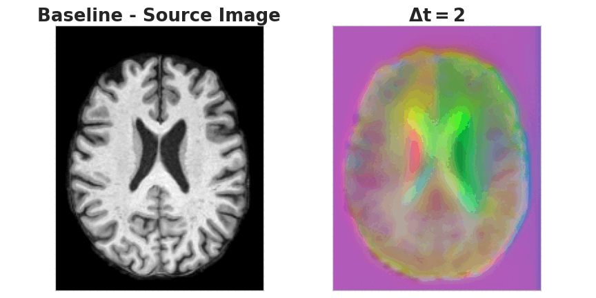

This Repo has some implementation of the paper:
**FutureMorph: Toward Predicting Future Deformation Fields in Longitudinal Imaging**,  Medical Imaging with Deep Learning (MIDL) 2026
Khawaled S, Van Herten RL, Saluja R, Sabuncu MR

# FutureMorph
**Abstract** Understanding how anatomy evolves over time is essential for tracking disease progression, quantifying risk, and studying healthy development and aging.
Existing approaches either synthesize future images without modeling geometry or perform longitudinal registration that require follow-up scans.
We introduce **FutureMorph**, a framework that treats longitudinal forecasting as metadata-conditioned prediction of future diffeomorphic deformation fields.
Given a baseline image (e.g., a brain MRI) and subject-level metadata (age, sex, and clinical variables), FutureMorph predicts time-indexed, subject-specific diffeomorphic deformation fields that explicitly describe future anatomical change. We employ a metadata-conditioned U-Net to estimate stationary velocity vector fields, which are integrated into smooth diffeomorphisms and applied using a spatial transformer to synthesize future images. Experiments on the OASIS-3 dataset show that our framework produces clinically meaningful predicted deformations and realistic future scans, capturing aging- and interval-dependent trajectories. Our work provides a new perspective for longitudinal imaging studies by unifying image synthesis and deformation modeling.

## **MRI Deformation Generation Controlled by $\Delta t$**
FutureMorph predcits anatomically plausible, time-varying deformations parameterized by $\Delta t$, given a baseline MRI image and associated meta-data.

## Note: code under devolopment  

## Training 
For training FutureMorph run the following command 

## Inference 
Inference script - soon 

